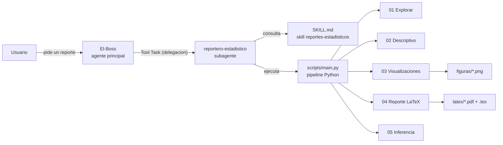

# Arquitectura del sistema

## Diagrama general



## Flujo de delegacion paso a paso

1. El usuario pide algo como *"hazme un analisis descriptivo de datos.csv"*.
2. **El-Boss** identifica la intencion y delega al subagente `reportero-estadistico` mediante la Tool Task, incluyendo:
   - La ruta o URL exacta del dataset.
   - Requisitos especiales indicados por el usuario.
3. El subagente fija el directorio de trabajo en la raiz del proyecto y ejecuta:

   ```powershell
   & "~/Projects/reportes-estadisticos/.venv/Scripts/python.exe" scripts\main.py "<fuente>"
   ```

4. El pipeline procesa el dataset por fases y compila el PDF con pdflatex (MiKTeX).
5. El subagente verifica las salidas y devuelve al coordinador:
   - Rutas exactas de `.tex`, `.pdf` y figuras.
   - Resumen breve (filas, columnas, advertencias).
6. **El-Boss** resume todo al usuario.

## Fases del pipeline

| Fase | Script | Salida |
|---|---|---|
| Exploracion | `01_explorar.py` | Estructura, tipos, nulos, duplicados |
| Descriptivos | `02_descriptivo.py` | Medidas resumen numericas y categoricas |
| Visualizaciones | `03_visualizaciones.py`, `03_boxplot.py` | PNG en `figuras/` |
| Reporte | `04_reporte.py` | LaTeX -> PDF en `latex/` |
| Inferencia | `05_inferencia.py` | Pruebas basicas complementarias |

## Manejo de errores del pipeline

| Error | Deteccion | Respuesta | Mensaje al usuario |
|---|---|---|---|
| Archivo no encontrado | `FileNotFoundError` en carga | Pipeline se detiene | "Error al cargar: [detalle]" |
| Formato no soportado | `ValueError` en carga | Pipeline se detiene | "Error al cargar: [detalle]" |
| Dataset vacio (0 filas/columnas) | Verificacion en `main.py:72-74` | Pipeline se detiene | "El dataset esta vacio" |
| Variables sin utilidad | Verificacion en `main.py:81-83` | Pipeline se detiene | "No contiene variables utiles" |
| Fallo en visualizaciones | `Exception` en `main.py:149-153` | Continua sin figuras | "Advertencia: Error generando visualizaciones" |
| Fallo compilacion LaTeX | Verificacion en `main.py:196-197` | Informa sin resultado PDF | "PDF: No se pudo generar (ver errores arriba)" |
| Valores faltantes | Manejado por pandas/scipy | Calcula sobre valores validos | Advertencia en resultados |

## Reglas de convivencia entre agentes

- El subagente **no modifica** el codigo del pipeline salvo orden explicita del usuario.
- Si pdflatex falla, se reporta el error tal cual; no se parchea el `.tex`.
- Regenerar el PDF de un dataset es seguro; nunca se tocan reportes de otros datasets.
