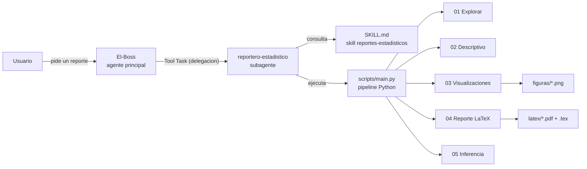

# Arquitectura del sistema

## Diagrama general



## Flujo de delegacion paso a paso

1. El usuario pide algo como *"hazme un analisis descriptivo de datos.csv"*.
2. **El-Boss** identifica la intencion y delega al subagente `reportero-estadistico` mediante la Tool Task, incluyendo:
   - La ruta o URL exacta del dataset.
   - Requisitos especiales indicados por el usuario.
3. El subagente fija el directorio de trabajo en la raiz del proyecto y ejecuta:

   ```powershell
   & "~/Projects/reportes-estadisticos/.venv/Scripts/python.exe" scripts\main.py "<fuente>"
   ```

4. El pipeline procesa el dataset por fases y compila el PDF con pdflatex (MiKTeX).
5. El subagente verifica las salidas y devuelve al coordinador:
   - Rutas exactas de `.tex`, `.pdf` y figuras.
   - Resumen breve (filas, columnas, advertencias).
6. **El-Boss** resume todo al usuario.

## Fases del pipeline

| Fase | Script | Salida |
|---|---|---|
| Exploracion | `01_explorar.py` | Estructura, tipos, nulos, duplicados |
| Descriptivos | `02_descriptivo.py` | Medidas resumen numericas y categoricas |
| Visualizaciones | `03_visualizaciones.py`, `03_boxplot.py` | PNG en `figuras/` |
| Reporte | `04_reporte.py` | LaTeX -> PDF en `latex/` |
| Inferencia | `05_inferencia.py` | Pruebas basicas complementarias |

## Reglas de convivencia entre agentes

- El subagente **no modifica** el codigo del pipeline salvo orden explicita del usuario.
- Si pdflatex falla, se reporta el error tal cual; no se parchea el `.tex`.
- Regenerar el PDF de un dataset es seguro; nunca se tocan reportes de otros datasets.
